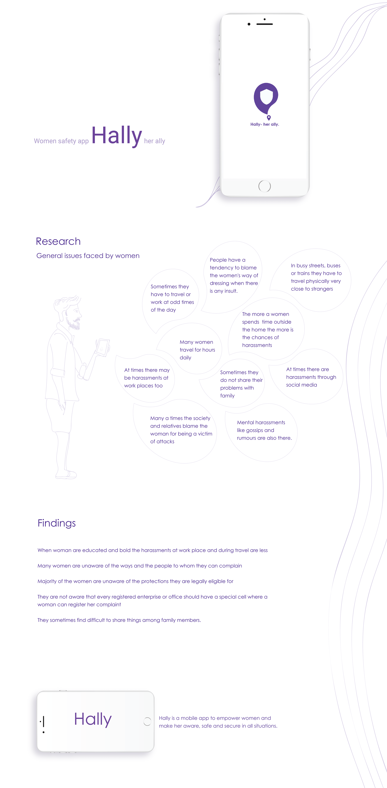

    

# Hally — Woman Safety app
>HALLY — Her personal ally!

 &nbsp;  &nbsp;  &nbsp;  &nbsp; 

## Current Scenario

    

In this era of technological advancements, we often fail to secure the safety of women in our society. These are some of the reports on Women Safety and neither of them say that women feel safe in our society.

>"We are not India’s daughters, proclaim women as their voices against sexual abuse and violence remain unheard." -[HERSTORY](https://yourstory.com/herstory/2019/12/india-women-safety-rape-hyderabad-voices)

>"In order to improve women safety in India the first task is to improve the number of women in every sphere of society. Along with that the change in mind set of people is very essential for the safety of women. From family to educational institutions men should be taught about respecting females. Further, there should be fast-track courts to hear the cases and they cases should be investigated in a time bound manner. Only strict laws can not solve the problem of women safety in India rather the implementation of these laws in a time bound manner can solve the issue to a large extent." -[Times of India](https://timesofindia.indiatimes.com/blogs/the-rock-bottom/women-safety-in-india/)

>"Safety of women is a major concern and the statistics in India continue to haunt it's women. Amidst the recent cases of violence and rapeculture, is India ready to prioritize the safety of women?" -[NSoJ](https://www.nsoj.in/stories/how-to-ensure-womens-safety-in-india)

This is a worldwide problem, some way or the other women are being harassed. We cannot change the rotten apples of our society overnight through technology, but we can surely bring this issue forward to the good apples who can take the necessary steps to prevent such cases, help the one in need, and also punish the offenders.

<strong>Technology can support the ideas we bring, but we need to apply those ideas in our society.</strong>

## Approach to the Problem

Since we could not change society, so we thought maybe we could give our society a chance to prevent such incidents from happening in the first place. We plan to build an application that would have a Distress button and by pressing this single button the victim could notify the people she had added from her contacts (near ones) by SMS, and also all the people who subscribe to our application with her location using a flash notification.

<strong>We named it 'HALLY' to lay stress on the fact that it's also Her Ally, and we are here to make sure nothing stops her.</strong>

## Research done regarding our project

**The safety of women is a global concern. Over the decades, scenarios of kidnapping as well as trafficking (irrespective of gender) are alarmingly on the rise despite different legal actions are in forced.** Woman covers almost half population of the country, so they are half participants in the growth and development of India. We are running in the 21st century, an advanced era, however it is very shameful to say about the doubtful safety of woman in India.

With advancement of tech’s, kidnappers have also become appreciably smart. The modus operandi of kidnapping have also become significantly updated. Generally, after every event of kidnapping, the victims were taken to some unknown places having unsuitable environment and the kidnappers make them captive and seek ransom or do sexual assault. And even sometimes the hostages have to cost their lives if their demands are not fulfilled.

Speaking Globally, according to a survey in 2018 by Forbes and many other trusted websites, India tops a global ranking of most dangerous countries for women.

Source: [poll2018](https://poll2018.trust.org/)  , [bigthink](https://bigthink.com/strange-maps/worst-countries-for-women) 

It is well-documented that during a war, a natural disaster or a pandemic, women’s bodies bear the worse brunt of the crisis. Domestic violence against women is already widespread and under-reported in India. **Now, at the time of the COVID-19 pandemic, the United Nations recognises domestic violence against women as a “shadow pandemic”. The COVID-19 pandemic has triggered a huge spike in domestic violence against women in China, Australia, France, the U.K., Spain, and Bangladesh, among others.** In India, too, the National Commission for Women has reported a large increase in distress calls from victims of domestic violence since the pandemic broke out. — [The Hindu](https://www.thehindu.com/opinion/op-ed/womens-safety-during-lockdown/article31324318.ece)

From a practical standpoint, the safety of women is at stake every time they go out at night, especially in less crowded areas and roads. Every day and every minute, some women of all walks of life (a mother, a sister, a wife, teenager girls, and even children) are getting harassed, molested, assaulted, and violated at various places all over the country. It just don’t stop here. Illegal “Human trafficking” in India remains a significant problem. People (both child and adults of both sex) are frequently illegally trafficked through India for the purposes of commercial sexual exploitation and forced/bonded labour.

Nowadays, self-defense techniques are not just enough for self-protection. A reliable, smart measure is required to ensure safety or protection from danger on the fly.

Thus we have chalked out an impressive measure to thwart such menace which would perhaps not eradicate the matter but do a great deal to that extent. Presenting **Hally** — **Her personal Ally!**

    <a href="https://www.youtube.com/watch?v=Jkcy9u1knDU">https://gifs.com/gif/hally-r81ZnK</a>

## Technologies Used
- Android Studio
- Firebase Authentication
- Firebase Firestore
- Firebase Cloud Messaging
- Firebase Cloud Function
- Google Maps Api
- Java, XML, JSON
- Retrofit, Glide
- Flash, SMS Messaging

## Preview

    

